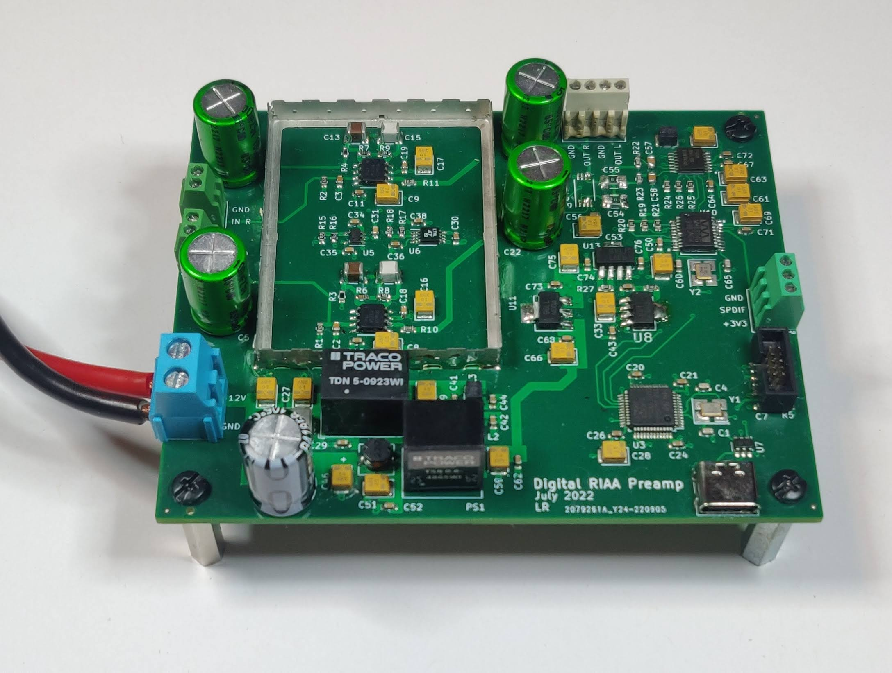

# DigiRIAA
A small and compact RIAA preamp with digital outputs
blablabla + picture 

## Description
schematic etc

## PCB

## Measures

## TODO
  - Get rid of STM32 HAL lib & add CMAKE etc. 
  - Remove TL072 buffer from PCB
